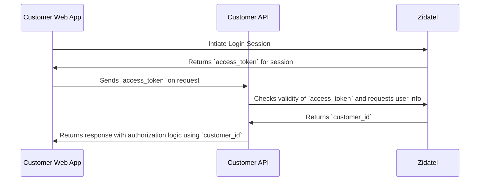

### Handling Authorization Scenario 1

**Things to make this work**
- can `customer_id` be cached for that specific access token? 
- can `customer_id` be stored in the `access_token` and use the open id client to check and validate the signature?
